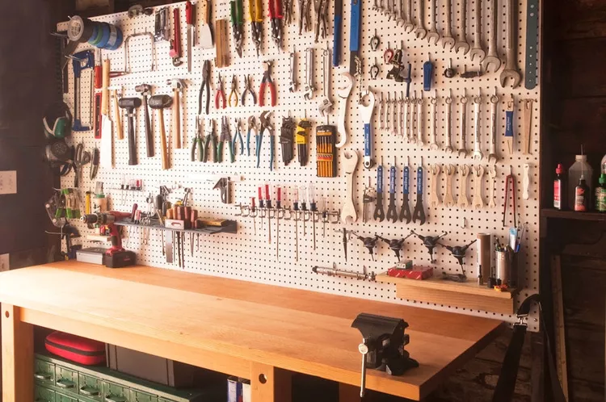

# GitOps Introduction

GitOps is the practice of using Git and code as the source of all configuration.

## Setup

> [!NOTE]
> Is based on the Dev Container extension and it's dependencies being present and running.
> Some platform recommandation:
> - Windows: [Docker Desktop](https://www.docker.com/products/docker-desktop/)
> - MacOS: [OrbStack](https://orbstack.dev/)
> - Linux: [Docker Engine](https://docs.docker.com/engine/install/)

1. Clone the repo
2. Open using the devcontainer `View -> Command Palette` + `Dev Containers: Reopen in Container``
3. Boot into the development shell: `nix develop`

## Workbench Overview

A short descript about each tool is inside [./docs/cheat-sheet/](/docs/cheat-sheet/). I advise using each tools inbuilt helper as well for quick reference `tofu --help`. For more details refer to each tools documentation site.

- [`nix`](https://nixos.org/): Declares which CLI tools and versions that are used in this project
- [`terraform`](https://developer.hashicorp.com/terraform): A commonly used tooling for provisioning and configuring external services
- [`tofu`](https://opentofu.org/): Alternative open source variant of Terraform, currently they are largely identical
- [`sops`](https://github.com/getsops/sops): Tool for managing secrets as part of a version controlled repository
- [`age-keygen`](https://github.com/FiloSottile/age): Modern tool for creating cryptographic keys, encrypting and decrypting encoded material
- [`ssh`](https://www.openssh.com/): Tool for managing machines through remmote shell

## External Services

- [GitHub](https://github.com/): A cloud provider delivering Version Control Systems, Collaboration platform, Identities, automated workers and binary storage repositories
- [Hetzner](https://www.hetzner.com/): A cheap, European, cloud provider delivering generic Compute, Network, and Storage Solutions

## Rational behind the tooling choice

  
  

The bar aim to reach is the organized toolbench where all the tools we need for a specific project are laid out and outlined.
